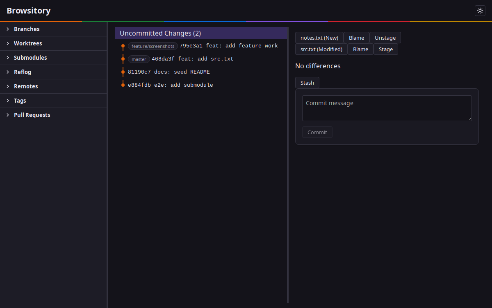
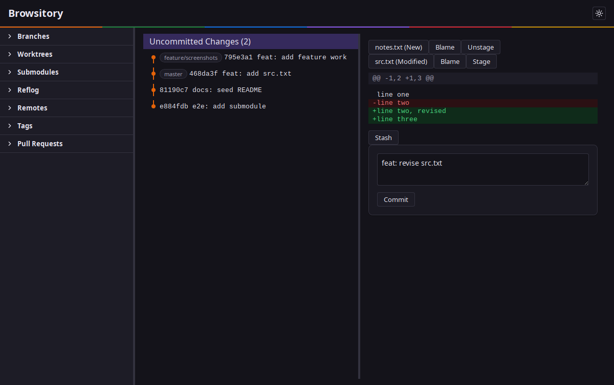
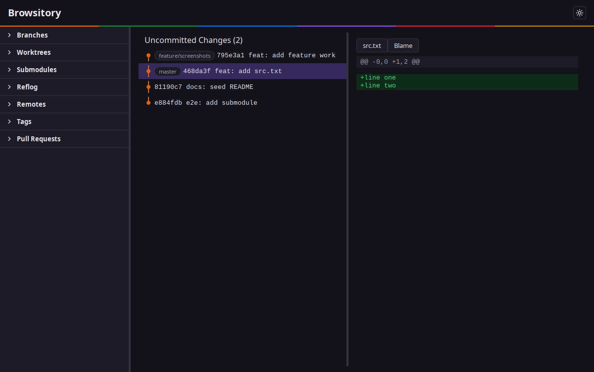
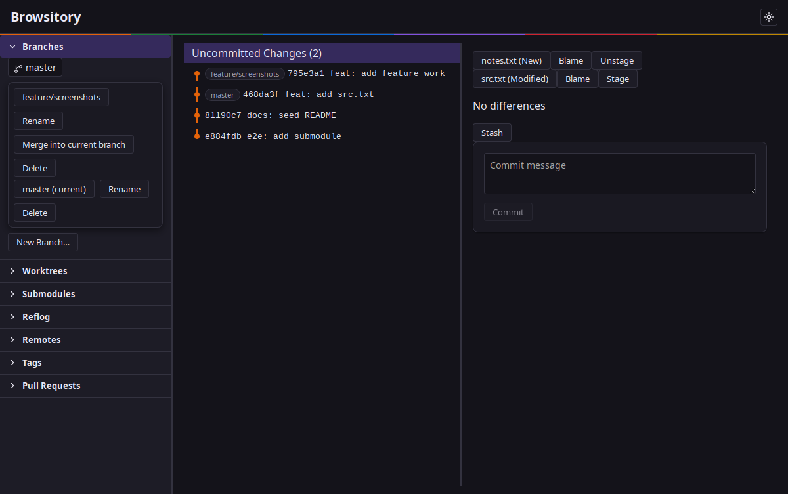
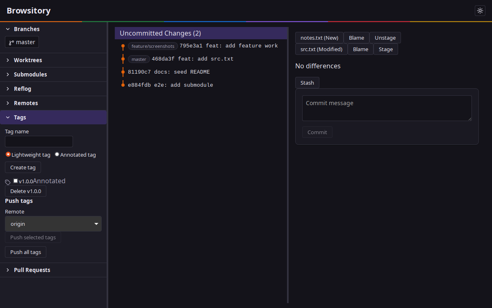
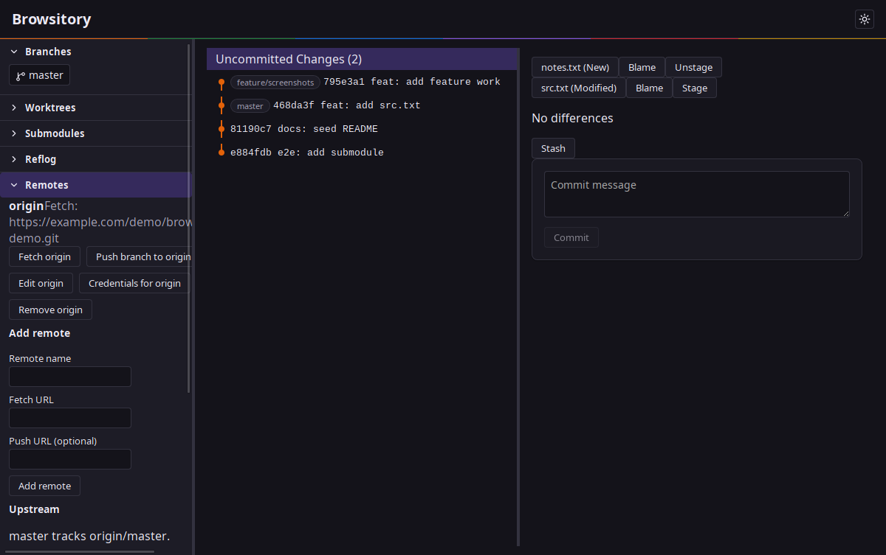
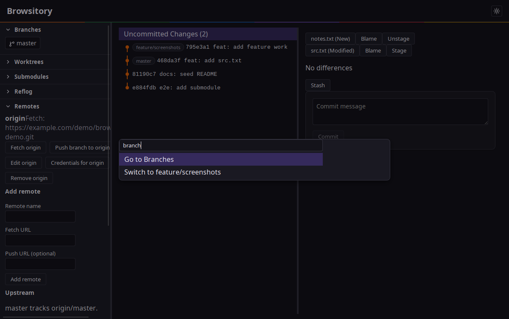

# Browsitory User Guide

A tour of Browsitory's UI and the day-to-day Git workflows it covers.

## Opening a repository

On launch, Browsitory shows a repo picker: pick a folder, or reopen one of your
recently used repositories.

## Overview

Once a repository is open, the window is split into three columns: the
**sidebar** (branches, worktrees, submodules, reflog, remotes, tags, pull
requests — each collapsed by default), the **commit graph** (your history,
newest first), and the **working-directory / diff pane** on the right.

## Staging and committing

The right-hand pane defaults to your working directory: unstaged and staged
files, each with **Stage**/**Unstage** and **Blame** buttons. Click a file to
preview its diff, type a commit message, and hit **Commit**. **Stash** sets
the current changes aside.

## Browsing history and diffs

Click any commit in the graph to see the files it touched; click a file to
view its diff, or **Blame** to see per-line authorship. Commits from every
local branch are shown, each tagged with the branches that point at it.

## Branches

Expand **Branches** to switch, create, rename, delete, or merge — the
button always shows the current branch. Creating a branch from a specific
commit, or starting a rebase onto one, is available from that commit's row
in the graph.

## Tags

Expand **Tags** to create lightweight or annotated tags, delete local ones,
and push a selection (or all of them) to a remote.

## Remotes

Expand **Remotes** to add or edit remotes, fetch, push the current branch,
manage saved credentials, and set or clear the current branch's upstream.

## Worktrees and submodules

**Worktrees** creates and removes linked worktrees, and opens one directly
in Browsitory. **Submodules** initializes and updates submodules, including
recursively.

## Reflog

**Reflog** lists recent HEAD movements per reference and can restore a
branch to an earlier entry — useful for recovering from a bad reset or
rebase.

## Rebase

Starting a rebase (from a branch or a specific commit) opens the rebase
planner as an overlay, where you can reorder/pick/squash/drop commits
before running it. Conflicts, once they happen, are resolved inline in the
diff pane; a paused rebase shows its progress and lets you continue or
abort.

## Pull requests

For GitHub and Bitbucket remotes, expand **Pull Requests** to save a
personal access token, list existing pull requests, and open a create form
targeting a source/target branch.

## Command palette

Press **Ctrl+K** (or **Cmd+K** on macOS) anywhere to open the command
palette: a fuzzy-searchable list of every action above, ranked by recent
use.

